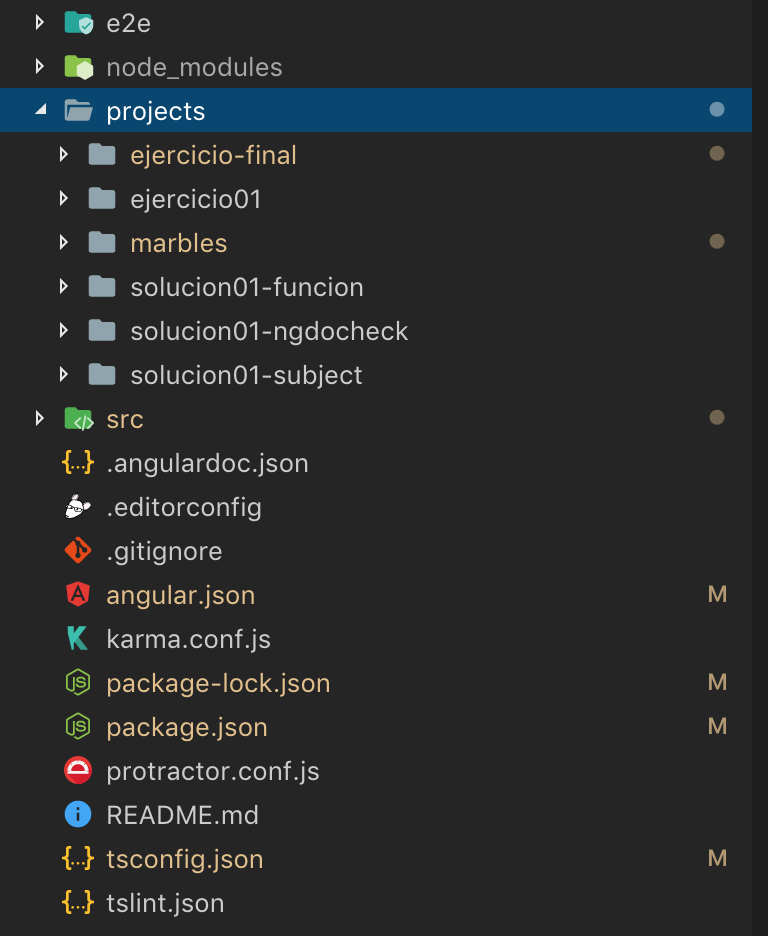

# Aplicaciones (desde la versión 6)

Un mismo *workspace* de Angular puede albergar varias aplicaciones.

Después de haber creado un proyecto con *ng new* se pueden generar aplicaciones con *ng generate*:

> ng generate application nombreapp [opciones]

Este comando creará un nuevo proyecto de Angular dentro de una carpeta *projects*. En la siguiente imagen se pueden ver 6 aplicaciones generadas en un mismo workspace:

Todas las aplicaciones del mismo workspace comparten las mismas librerías de npm. Es decir, solamente existe un único directorio *node_modules*, compartido por todas las aplicaciones.  Si se acutaliza alguna librería, se estará actualizando dicha librería para todas las aplicaciones.

Una aplicación/projecto dentro de un workspace consta de los siguientes archivos y directorios

- e2e
- src
- browserlist
- karma.conf.js
- tsconfig.app.json
- tsconfig.spec.json
- tslint.json

En los directorios e2e y src programaremos nuestros tests y nuestra aplicación, como de costumbre.

El resto de ficheros son ficheros de configuración que sobreescriben a los ficheros de configuración general del workspace.

Para servir una aplicación, utilizaremos el comando *ng serve* indicando el nombre de la aplicación:

> ng serve nombreapp [opciones]

Y del mismo modo, para hacer un build, lo haremos indicando el nombre de la aplicación:

> ng build nombreapp [opciones]

Si no indicamos ningún nombre de aplicación los comandos afectarán a la aplicación/proyecto raíz (la aplicación que está fuera del directorio projects).

Para generar elementos (componentes, directivas, servicios...) en una aplicación/proyecto concreto, el comando generate se utiliza de la siguiente manera:

> ng generate component ruta/nombrecomponente --project=nombreapp [resto de opciones]

