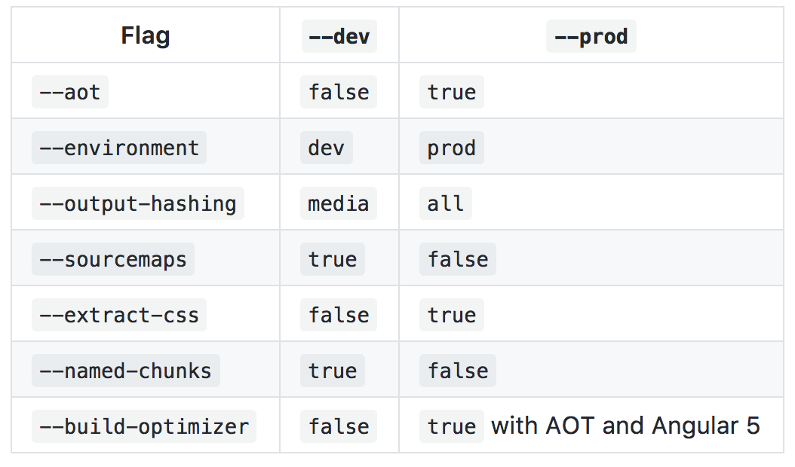

# Deployment

Para realizar el deployment de una aplicación Angular, nos servimos del comando *ng build*.

## Crear un build 

Para crear un *build*. Basta con ejecutar el comando *ng build*.

> ng build

Por defecto, nos creará un directorio *dist* en el que colocará el resultado de la compilación. 

Sin embargo el build generado de esta forma no es el más optimo para producción. El comando *ng build* tiene muchos modificadores y opciones. 

## Crear un build en un entorno específico

Podemos crear builds del entorno de desarrollo o del entorno de producción:

```
# Estas son equivalentes
ng build --target=production --environment=prod
ng build --prod --env=prod
ng build --prod

# y estas también
ng build --target=development --environment=dev
ng build --dev --e=dev
ng build --dev
ng build
```

Podemos crear otros entornos siguiendo estos 2 pasos:

- Crear un fichero: src/environments/environment.NAME.ts

- Añadir { "NAME": 'src/environments/environment.NAME.ts' } al objeto apps[0].environments en .angular-cli.json

Y ya podemos usar el nuevo entorno con nuestros comandos *ng build* y *ng serve*.

## Modificar la etiqueta base

```
# Establece el href de la etiqueta base a /myUrl/ en el index.html
ng build --base-href /myUrl/
ng build --bh /myUrl/
```

## Comparación entre --dev y --prod

Los modificadores --dev y --prod establecen valores por defecto de otros modificadores:



Además, --prod ejecuta UglifyJS en el código.

## --build-optimizer y --vendor-chunk

Cuando se usa Build Optimizer, vendor chunk se deshabilita por defecto. Se puede habilitar con --vendor-chunk=true.

El tamaño total de los bundles es menor si no se separan en fichero distintos la app de los vendor ya que permite a Uglify identificar y eliminar bastante más cantidad de código no utilizado.

## Recursos en CSSs

Los recursos incluidos en CSS (imágenes y fonts) se copiar automáticamente como parte del build. 

Se pueden ver estos recursos en la raíz del directorio *dist/*

## Soporte de ES2005

Para realizar un build en ES2015, hay que editar el fichero  ./tsconfig.json para usar "target": "es2015" (en vez de es5).


En este enlace podemos ver todas las opciones de ng build:

https://github.com/angular/angular-cli/wiki/build

En este otro enlace dan consejos para configurar el servidor web, analizar el rendimiento de la aplicación...

https://angular.io/guide/deployment


[Índice](index.md)
