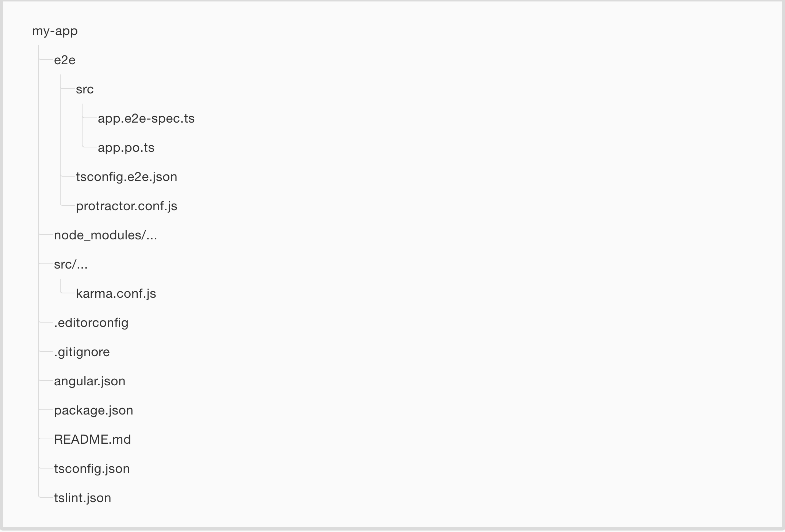
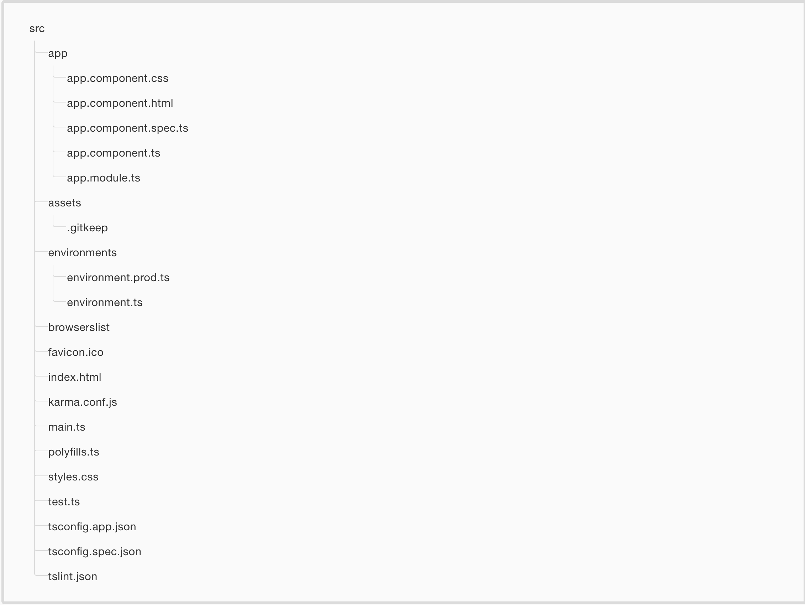

# Estructura de un proyecto Angular 6

# Directorio raíz

El directorio raíz de un proyecto angular contiene los siguientes elementos:



* **e2e/:** end-to-end tests
* **node_modules/:** módulos de terceros listados en package.json.
* **src/:** Directorio donde reside la aplicación
* **.editorconfig:** Configuración para el editor (para intentar que todo el equipo de desarrollo utilice la misma configuración). (http://editorconfig.org)
* **.gitignore:** archivos a ignorar por Git
* **angular.json:** Fichero de configuración de angular.
* **package.json:** Lista de paquetes de terceros que usa el proyecto.
* **README.md:** Pre-relleno con información sobre comandos de angular.
* **tsconfig.json:** Configuración para TypeScript para el IDE
* **tslint.json:** Configuración para TSLint

El directorio src/ tiene la estructura siguiente:



* **app/app.component.{ts,html,css,spec.ts}:** El componente raíz de la aplicación (archivo typescript, archivo html, archivo css y archivo spec.ts para test).
* **app/app.module.ts:** Define el módulo AppModule, (el módulo raíz) que le dice a angular cómo ensamblar la aplicación.
* **assets/:** Directorio para los assets (se copiará tal cual al construir la aplicación).
* **environments/:** Este directorio contiene un archivo por cada entorno. En el se encuentra la configuración de algunas variables que se utilizan en la aplicación. Por ejemplo, quizás utilices una API REST diferente durante el desarrollo que la que utilizarás en producción, diferentes tokens de analytics, servicios mock... Angular cli elige el fichero adecuado en cada caso.
* **browserslist:** Fichero de configuración para indicar a las distintas herramientas los **target browsers**.
* **favicon.ico:** El icono favicon.
* **index.html:** El html principal.
* **karma.conf.js:** Configuración de Karma (para tests unitarios)
* **main.ts:** El punto de entrada principal de la aplicación.
* **polyfills.ts:**
Cada navegador tiene diferente grado de soporte de los estándares web. Polyfills es una librería javascipt que normaliza esas diferencias. [Browser Support Guide](https://angular.io/guide/browser-support).
* **styles.css:** Estilos css globales de la aplicación.
* **test.ts:** Punto de entrada principal a los tests unitarios.
* **tsconfig.app.json:** Configuración del compilador TypeScript para la aplicación angular.
* **tsconfig.spec.json:** Configuración del compilador TypeScript para los tests unitarios(tsconfig.spec.json).
* **tslint.json:** Configuración para el TSLint y Codelyzer, utilizados al ejecutar el comando ng lint.


## Añadir librería externa a un proyecto Angular. Ejemplo JQuery

Supongamos que deseamos añadir jquery a nuestro proyecto. La forma más correcta
de hacerlo es indicándolo en la sección `build/scripts` del archivo de 
configuración `angular.json`:

`angular.json`
```javascript
...
"projects": {
    ...
    "nombre_proyecto": {
        ...
        "architect": {
            ...
            "build": {
                ...
                "options": {
                    ...
                    "scripts": ["node_modules/jquery/dist/jquery.min.js"]
                }
            }
        }
    }
}
```

Para que esto funcione debemos instalar jquery:

```bash
> npm install --save jquery
```

Si además queremos tener disponibles los tipos para typescript:

```javascript
> npm install --save-dev @types/jquery
```

Por último, en el componente que deseemos utilizar jquery:

```javascript
import * as $ from 'jquery'
```

Y ya podemos usar la librería en nuestro código.


[Índice](index.md)
