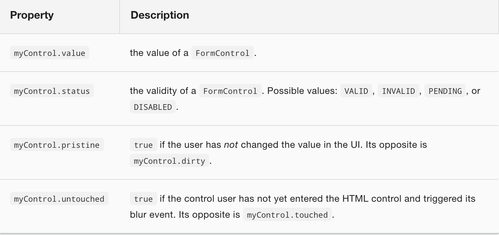

# Formularios model-driven (formularios reactivos)

El módulo de formularios reactivos ofrecen facilidad de utilizar patrones, testeo y validaciones directamente desde el componente en lugar de hacerlo desde la plantilla.

Utilizaremos el mismo formulario de partida de antes:

```html
  <div class="container">
      <h1>Hero Form</h1>
      <form>
        <div class="form-group">
          <label for="name">Name</label>
          <input type="text" class="form-control" id="name" required>
        </div>
  
        <div class="form-group">
          <label for="alterEgo">Alter Ego</label>
          <input type="text" class="form-control" id="alterEgo">
        </div>

        <div class="form-group">
          <label for="power">Hero Power</label>
          <select class="form-control" id="power"  name="power" required>
            <option *ngFor="let pow of powers" [value]="pow">{{pow}}</option>
          </select>
        </div>
  
        <button type="submit" class="btn btn-success">Submit</button>
  
      </form>
  </div>
```
El mismo componete de partida,

```typescript
  import { Component } from '@angular/core';
  import { Hero }    from './hero';

  @Component({
    selector: 'hero-form',
    templateUrl: './hero-form.component.html'
  })
  export class ReactiveFormComponent {

    powers = ['Really Smart', 'Super Flexible',
              'Super Hot', 'Weather Changer'];

    hero = new Hero(18, 'Dr IQ', this.powers[0], 'Chuck Overstreet');
  }
```

Y esta vez importamos el módulo ReactiveFormsModule de *@angular/forms*.

```typescript
import { ReactiveFormsModule } from '@angular/forms';

@NgModule({
  imports: [
    ...
    ReactiveFormsModule,
    ...
  ],
```

Al contrario de lo que ocurría con los formularios *template-driven*, en esta ocasión prácticamente toda la programación estará en el componente.

## Clases esenciales

Conviene echar un vistazo a las clases que nos proporciona *ReactiveFormsModule*

- **AbstractControl:** Es la clase base abstracta de las otras 3 clases: FormControl, FormGroup, y FormArray.
- **FormControl:** Controla el valor y estado de validez de un control de formulario individual. Se corresponede con un control de formulario HTML como un input o un select.
- **FormGroup:** Controla el valor y validez de un grupo de instancias AbstractControl. Todo formulario es un único FormGroup. Ya dentro de ese FormGroup puede haber cualquier cantidad de FormControl, FormGroup o FormArray
- **FormArray:** Controla el valor y estado de validez de un array de instancias AbstractControl.

## FormGroup básico

```typescript
  export class ReactiveFormComponent {
    heroForm: FormGroup;

    constructor(private fb: FormBuilder) {
      this.createForm();
    }

    createForm() {
      this.heroForm = this.fb.group({
        name: ['', Validators.required ],
        street: '',
        city: '',
        state: '',
        zip: '',
        power: '',
        sidekick: ''
      });
    }
  }
```

En este ejemplo, el formulario heroForm consta de un FormGroup con 7 FormControls.

Prácticamente lo único que tendremos que hacer en el html es asociar cada control HTML con su control correspondiente FormControl.

```html
  <input class="form-control" formControlName="name">
```

## Anindando FormGroup

```typescript
  createForm() {
    this.heroForm = this.fb.group({ 
      name: ['', Validators.required ],
      address: this.fb.group({ 
        street: '',
        city: '',
        state: '',
        zip: ''
      }),
      power: '',
      sidekick: ''
    });
```

Y no hay que cambiar nada en el html

## FormControl

```typescript
  this.alterEgoControl = new FormControl('Alter Ego por defecto', Validators.required);

  this.heroForm = this.fb.group({
      name: 'Nombre por defecto',
      alterEgo: this.alterEgoControl
  });
```

## FormGroup.get()

Con el método get de FormGroup podemos acceder a un control concreto

```html
  <p>Name value: {{ heroForm.get('name').value }}</p>
  <p>Street value: {{ heroForm.get('address.street').value}}</p>
```

Las propiedades de un FormControl son



## Validadores

https://angular.io/api/forms/Validators

## FormGroup.setValue()

Podemos establecer valores en cualquier momento al formulario completo con setValue. Se pueden asociar los valores de un objeto completo si las propiedades del objeto y del formulario coinciden.

```typescript
  this.heroForm.setValue({
    name:    this.hero.name,
    address: this.hero.addresses[0] || new Address()
  });
```

## FormGroup.reset()

También podemos resetear el formulario

```typescript
  this.heroForm.reset();
```

## FormArray

```typescript
this.heroForm = this.fb.group({
  name: ['', Validators.required ],
  addresses: this.fb.array([]), 
  power: '',
  sidekick: ''
});
```

El array se podrá recorrer mediante la propiedad .controls

```html
<div formArrayName="addresses" class="well well-lg">
  <div *ngFor="let address of addresses.controls; let i=index" [formGroupName]="i" >
    <!-- The repeated address template -->
  </div>
</div>
```

Y se pueden añadir utilizando el método push como en un array normal y corriente.

```html
<button (click)="addAddress()" type="button">Add address</button>
```

```typescript
addAddress() {
  this.heroForm.get('addresses').push(this.fb.group(new Address()));
}
```

## Observar cambios en un control

Los formularios reactivos tienen algunas características que funcionan con Observables. Por ejemplo la clase FormControl tiene un método *valueChanges* que devuelve un Observable cada vez que el valor cambia.

```typescript
  nameChangeLog: string[] = [];

  constructor(private fb: FormBuilder) {
    this.createForm();
    this.logNameChange();
  }

  logNameChange() {
    const nameControl = this.heroForm.get('name');
    nameControl.valueChanges.subscribe(
      (value: string) => this.nameChangeLog.push(value)
    );
  }
```


