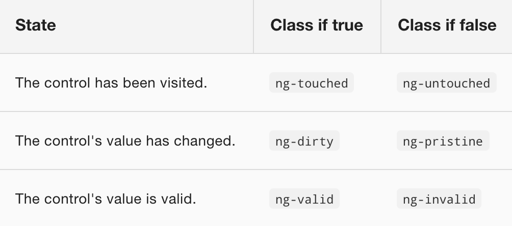

# Formularios Template-driven 

Es posible construir casi cualquier formulario con plantillas de Angular. Se pueden colocar los elementos con libertad y creatividad, hacer binding de los controles con los datos, especificar reglas de validación y mostrar errores de validación, habilitar y deshabilitar controles según condiciones...

Vamos a utilizar las potencia de los formularios de Angular al siguiente ejemplo: 

```html
  <div class="container">
      <h1>Hero Form</h1>
      <form>
        <div class="form-group">
          <label for="name">Name</label>
          <input type="text" class="form-control" id="name" required>
        </div>
  
        <div class="form-group">
          <label for="alterEgo">Alter Ego</label>
          <input type="text" class="form-control" id="alterEgo">
        </div>

        <div class="form-group">
          <label for="power">Hero Power</label>
          <select class="form-control" id="power"  name="power" required>
            <option *ngFor="let pow of powers" [value]="pow">{{pow}}</option>
          </select>
        </div>
  
        <button type="submit" class="btn btn-success">Submit</button>
  
      </form>
  </div>
```

```typescript
  import { Component } from '@angular/core';
  import { Hero }    from './hero';

  @Component({
    selector: 'hero-form',
    templateUrl: './hero-form.component.html'
  })
  export class HeroFormComponent {

    powers = ['Really Smart', 'Super Flexible',
              'Super Hot', 'Weather Changer'];

    hero = new Hero(18, 'Dr IQ', this.powers[0], 'Chuck Overstreet');
  }
```


Existe un módulo en el *@angular/forms* llamado *FormsModule* que nos da acceso a los tipos *ngForm* y *ngModel* para tipar variables y a la directiva *ngModel* que ya hemos utilizado alguna vez para realizar el doble binding.

```typescript
  imports: [
    ...
    FormsModule,
    ...
  ],
```


## Two way data binding con ngModel

No vemos los datos del héroe en el formulario porque no hemos hecho binding todavía con el héroe.

Utilizamos *ngModel* para asociar cada control del formulario a una propiedad del héroe. Recordemos que para utilizar *ngModel* es necesario declarar el atributo *name*.

También utilizaremos un *chivato* (diagnostic) para comprobar que efectivamente se realiza el binding.


```html
  <div class="container">
      <h1>Hero Form</h1>
      <form>
        {{diagnostic() | json}}
        <div class="form-group">
          <label for="name">Name</label>
          <input type="text" class="form-control" id="name" required [(ngModel)]="hero.name" name="name">
        </div>

        <div class="form-group">
          <label for="alterEgo">Alter Ego</label>
          <input type="text" class="form-control" id="alterEgo" [(ngModel)]="hero.alterEgo" name="alterEgo">
        </div>

        <div class="form-group">
          <label for="power">Hero Power</label>
          <select class="form-control" id="power"  name="power" required [(ngModel)]="hero.power" name="power">
            <option *ngFor="let pow of powers" [value]="pow">{{pow}}</option>
          </select>
        </div>

        <button type="submit" class="btn btn-success">Submit</button>

      </form>
  </div>
```

```typescript
  // TODO: Eliminar esta función al terminar
  get diagnostic() { 
    return JSON.stringify(this.hero);
  }
```

## Marcar visualmente el estado de los controles 

Utilizar ngModel en un formulario proporciona mucho más que tan solo two-way data binding. También informa de si el usuario ha tocado el control, si el valor ha cambiado o si el valor es válido o no.

La directiva ngModel actualiza el control con class CSS especiales de Angular que reflejan el estado del control. Esas clases se pueden utilizar para cambiar la apariencia del control.



Vamos a añadir una template reference variable llamada spy al input del nombre para ver las clases css asociadas en cada momento.

```html
  <div class="form-group">
    <label for="name">Name</label>
    <input type="text" class="form-control" id="name" required [(ngModel)]="hero.name" name="name" #spy>
    <br>{{spy.className}}
  </div>
```

Gracias a estas clases podemos marcar visualmente mediante css el estado de los controles.

```css
  .ng-valid[required], .ng-valid.required  {
    border-left: 5px solid #42A948; /* green */
  }

  .ng-invalid:not(form)  {
    border-left: 5px solid #a94442; /* red */
  }
```

## Mostrar y ocultar mensajes de errores de validación

Vamos a poner otro template reference variable al control del nombre pero tipándolo al tipo ngModel

```html
  <div class="form-group">
    <label for="name">Name</label>
    <input type="text" class="form-control" id="name" required [(ngModel)]="hero.name" name="name" #spy #name="ngModel">
    <br>{{spy.className}}
  </div>
```

También añadiremos un mensaje de error, que aparecera cuando el nombre esté vacío.

```html
  <div class="form-group">
    <label for="name">Name</label>
    <input type="text" class="form-control" id="name" required [(ngModel)]="hero.name" name="name" #spy #name="ngModel">
    <br>{{spy.className}}
  </div>
  <div [hidden]="name.valid || name.pristine" class="alert alert-danger">
    Name is required
  </div>
```


## Hacer submit del formulario con el evento onSubmit

```html
  <form (ngSubmit)="onSubmit()">
  ...
  <button type="submit" class="btn btn-success">Añadir</button>
```

```typescript
  onSubmit() {
    //Hacer lo que sea
    //Luego limpiar el formulario
    this.hero.name = '';
    this.hero.power = this.powers[0];
    this.hero.alterEgo = '';
  }
```


## Desactivar el botón de submit hasta que el formulario sea válido

Vamos a poner otro template reference variable al formulario, ahora de tipo ngForm

```html
  <form (ngSubmit)="onSubmit()" #heroForm="ngForm">
```

Un objeto ngForm tiene una propiedad *form* que es a su vez otro objeto. Este último objeto tiene una 
propiedad booleana *valid* que indica si el formulario es válido o no.

Así pues, podemos desactivar el botón de submit y no activarlo hasta que el formulario sea válido.

```html
  <form (ngSubmit)="onSubmit()" #heroForm="ngForm">
  ...
  <button type="submit" class="btn btn-success" [disabled]="!heroForm.form.valid">Añadir</button>
```


## Limpiar el formulario

El objeto ngForm tiene también un método *reset()* que limpia completamente el formulario.

```html
  <form (ngSubmit)="onSubmit(); heroForm.reset()" #heroForm="ngForm">
```

De esta forma, el componente no necesita ocuparse de esa tarea

```typescript
  onSubmit() {
    //Hacer lo que sea
  }
```


## Mostrar mensaje cuando se envíe el formulario

Ya no fomra parte de los formularios, pero es muy típico mostrar un mensaje al enviar el formulario.

```html
<div [hidden]="!submitted">
  <h2>¡Gracias!</h2>
</div>
```

```typescript
export class HeroFormComponent implements OnInit {

  powers = ['Really Smart', 'Super Flexible',
            'Super Hot', 'Weather Changer'];

  hero = new Hero(18, 'Dr IQ', this.powers[0], 'Chuck Overstreet');

  submitted = false;

  constructor() { }

  ngOnInit() {
  }

  onSubmit() {
    //Hacer lo que sea
    this.submitted = true;
  }
}

Se podría haber hecho con la propiedad .submitted de ngForm
