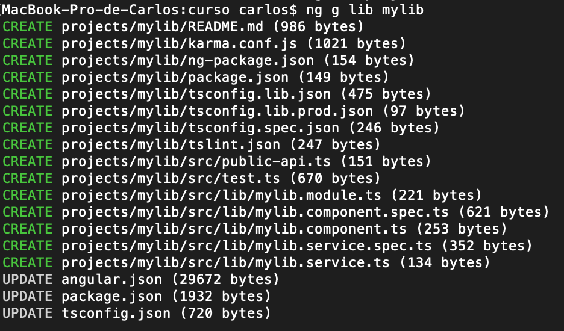
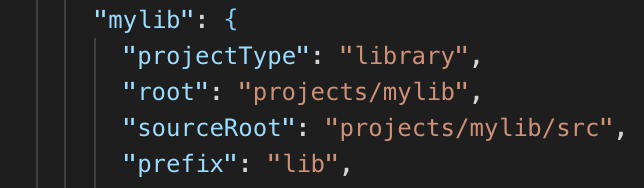

# Librerías

Dentro de la carpeta projects de un workspace de Angular podemos encontranos 2 tipos de *project items*:

- application: es una aplicación web spa
- library: es un módulo compartido por varias aplicaciones

Estos *project items* se generan con el comando *ng generate*

> ng generate application MyNewApp

> ng generate library MyNewLibrary

## Creación de una librería

Como de costumbre, el comando generate nos informa de los archivos creados y modificados.

> ng g lib mylib

Los ficheros creados dentro de **projects/mylib** son una aplicación de Angular con un módulo, un servicio y un componente pre-creados. El único fichero "diferente" es **src/public-api.ts**. Veremos su utilidad dentro de poco.

Además de los ficheros propiamente de la librería, angular modifica 3 ficheros de configuración del workspace: angular.json, package.json y tsconfig.json.

En el fichero angular.json podemos ver que se ha dado de alta un nuevo item dentro de la sección *projects*. A diferencia de las aplicaciones, este ítem está catalogado con *projectType: library*.

https://medium.com/@tomsu/how-to-build-a-library-for-angular-apps-4f9b38b0ed11

## Incluir una aplicación dentro de otra

https://medium.com/disney-streaming/combining-multiple-angular-applications-into-a-single-one-e87d530d6527

## Otros enlaces

- https://blog.angularindepth.com/angular-workspace-no-application-for-you-4b451afcc2ba

- https://medium.com/@angularlicious/angular-6-workspace-test-drive-cfe24bbceeb3
