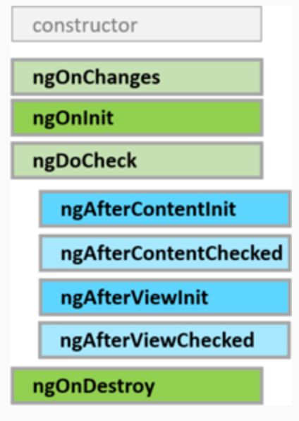

# Ciclo de vida de un componente

Un componente tiene un ciclo de vida gestionado por Angular.

Angular crea el componente, lo renderiza, crea y renderiza a sus "hijos", lo chequea cuando sus datos bindeados cambian y lo destruye antes de quitarlo del DOM.

Angular ofrece hooks de cada paso del ciclo de vida para proporcionar la habilidad de actuar cuando tienen lugar.

Una directiva tiene el mismo conjunto de *lifecycle hooks* excepto aquellos específicos al contenido del componente y las vistas.



## Sequencia del ciclo de vida

- **ngOnChanges():** 
Es llamado cuando Angular establece datos asociados a propiedades asociadas a @Input. El método recibe un objeto SimpleChanges con el valor actual y el valor anterior.
Es llamado antes de ngOnInit() y cuando una o más variables @Input cambie.
- **ngOnInit():**	
Es llamado una única vez, después del primer ngOnChanges() cuando Angular ha renderizado las propiedades bindeadas y ha seteado las propiedades decoradas con @Input. En este momento es cuando se puede dar por **inicializado** el componente/directiva.
- **ngDoCheck():**
Es llamado durante cada ciclo de detección de cambios, después de cada ngOnChanges() y después de ngOnInit(). Puede servir para gestionar cambios que Angular no sea capaz de tratar por sí mismo.
- **ngAfterContentInit():**
Es llamado después de que Angular proyecte el contenido externo dentro de la vista del componente. Es llamado después del primer ngDoCheck().
Sólo disponible para componentes.
- **ngAfterContentChecked():**	
Responde después de que Angular compruebe el contenido proyectado en el componente.
Es llamado después de cada  ngAfterContentInit() y de cada ngDoCheck().
Sólo disponible para componentes.
- **ngAfterViewInit():**	
Responde después de que Angular inicialice la vista del componente y las vistas hijas.
Es llamado una sola vez después del primer ngAfterContentChecked().
Sólo disponible para componentes.
Es el lugar seguro para trabajar con variables obtenidas con @ViewChild.
- **ngAfterViewChecked():**	
Responde después de que Angular compruebe la vista del componente y las vistas hijas.
Es llamado después de ngAfterViewInit y de cada ngAfterContentChecked().
Sólo disponible para componentes.
- **ngOnDestroy():**
Es llamado usto antes de que Angular destruya el componente. Se puede utilizar por ejemplo para desuscribirse de los observables.


Ejercicio: Poner console.log() en todos los métodos del ciclo de vida de los componentes ParentComponent y ChildComponent y observar cuándo se ejecutan.

```ts
ngOnInit() {
  console.log('ngOnInit');
}

ngOnChanges() {
  console.log('ngOnChanges');
}

ngDoCheck() {
  console.log('ngDoCheck');
}

ngAfterContentInit() {
  console.log('ngAfterContentInit');
}

ngAfterContentChecked() {
  console.log('ngAfterContentChecked');
}

ngAfterViewInit() {
  console.log('ngAfterViewInit');
}

ngAfterViewChecked() {
  console.log('ngAfterViewChecked');
}

ngOnDestroy() {
  console.log('ngOnDestroy');
}
```


[Índice](index.md)
