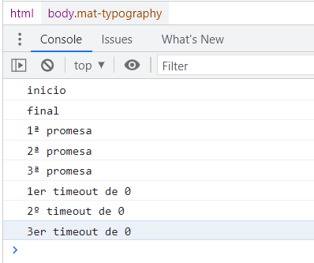
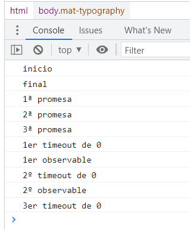
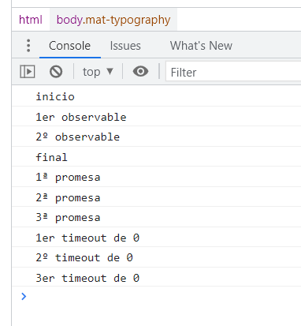
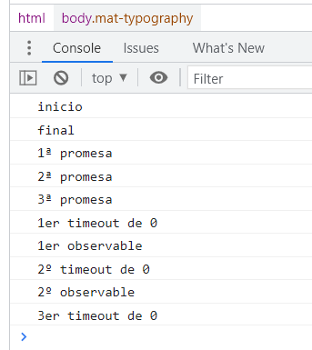
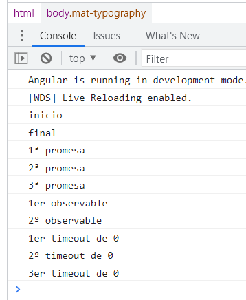
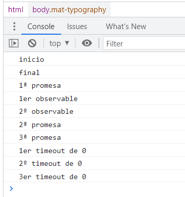

# Schedulers

---
**Nota**: Antes de leer este artículo se recomienda ver los siguientes vídeos:

https://www.youtube.com/watch?v=8aGhZQkoFbQ

https://www.youtube.com/watch?v=cCOL7MC4Pl0

---

Dado este código, ¿en qué orden aparecen los mensajes en la consola del navegador?

```js
console.log('inicio');

setTimeout(()=>console.log('1er timeout de 0'), 0);
Promise.resolve('dummy').then(()=>console.log('1ª promesa'));

setTimeout(()=>console.log('2º timeout de 0'), 0);
Promise.resolve('dummy').then(()=>console.log('2ª promesa'));

setTimeout(()=>console.log('3er timeout de 0'), 0);
Promise.resolve('dummy').then(()=>console.log('3ª promesa'));

console.log('final');
```

Dado que las promesas van a la cola de micro tasks y los setTimeout a la cola de macro tasks, el orden de aparición de los mensajes en la consola es el siguiente:



Nada nuevo bajo el sol. 

Añadámosle ahora observables.

```diff
+ const observable$ = timer(0); // emite a los 0 milisegundos

console.log('inicio');

setTimeout(()=>console.log('1er timeout de 0'), 0);
Promise.resolve('dummy').then(()=>console.log('1ª promesa'));

+ observable$.subscribe(()=>console.log('1er observable'));

setTimeout(()=>console.log('2º timeout de 0'), 0);
Promise.resolve('dummy').then(()=>console.log('2ª promesa'));

+ observable$.subscribe(()=>console.log('2º observable'));

setTimeout(()=>console.log('3er timeout de 0'), 0);
Promise.resolve('dummy').then(()=>console.log('3ª promesa'));

console.log('final');
```

¿Cuál será ahora el orden de aparición de los mensajes en la consola?



Parece pues que los observables van a la cola de macro tasks, junto con los setTimeout().

Pero dado que la idea era emitir un valor inmediatamente, lo podíamos haber hecho con of() en vez de con timer(0).

```diff
+ const observable$ = of('dummy');

console.log('inicio');

setTimeout(()=>console.log('1er timeout de 0'), 0);
Promise.resolve('dummy').then(()=>console.log('1ª promesa'));

observable$.subscribe(()=>console.log('1er observable'));

setTimeout(()=>console.log('2º timeout de 0'), 0);
Promise.resolve('dummy').then(()=>console.log('2ª promesa'));

observable$.subscribe(()=>console.log('2º observable'));

setTimeout(()=>console.log('3er timeout de 0'), 0);
Promise.resolve('dummy').then(()=>console.log('3ª promesa'));

console.log('final');
```

¿Cuál será ahora el orden de aparición de los mensajes en la consola? La respuesta puede que sorprenda.



Estos observables se están ejecutando de forma síncrona. Sin embargo los creados con timer() se están ejecutando en la cola de macro tasks.

Esto se debe a los **Schedulers**.

> A Scheduler lets you define in what execution context will an Observable deliver notifications to its Observer.

Con los schedulers podemos cambiar el comportamiento del observable creado con of() para que entregue la notificación en un momento que sea más adecuado para nuestros intereses.

Por ejemplo configurando el observable para que se ejecute en el asyncScheduler, en vez de ejecutarse de forma síncrona

```diff
+ const observable$ = of('dummy').pipe(observeOn(asyncScheduler));

console.log('inicio');

setTimeout(()=>console.log('1er timeout de 0'), 0);
Promise.resolve('dummy').then(()=>console.log('1ª promesa'));

observable$.subscribe(()=>console.log('1er observable'));

setTimeout(()=>console.log('2º timeout de 0'), 0);
Promise.resolve('dummy').then(()=>console.log('2ª promesa'));

observable$.subscribe(()=>console.log('2º observable'));

setTimeout(()=>console.log('3er timeout de 0'), 0);
Promise.resolve('dummy').then(()=>console.log('3ª promesa'));

console.log('final');
```

El orden de ejecución sería el siguiente:



## Scheduler Types


- **null**: By not passing any scheduler, notifications are delivered synchronously and recursively. Use this for constant-time operations or tail recursive operations.

- **queueScheduler**: Schedules on a queue in the current event frame (trampoline scheduler). Use this for iteration operations.

- **asapScheduler**: Schedules on the micro task queue, which is the same queue used for promises. Basically after the current job, but before the next job. Use this for asynchronous conversions.

- **asyncScheduler**: Schedules work with setInterval. Use this for time-based operations.

- **animationFrameScheduler**: Schedules task that will happen just before next browser content repaint. Can be used to create smooth browser animations.

Orden de ejecución con animationFrameScheduler



Orden de ejecución con asapScheduler


 

## Utilización de Schedulers

Todos los observables que operan con concurrencia/asincronía tienen schedulers opcionales. Si no indicas ningún scheduler, RxJS elegirá uno por defecto basándose en el principio de menor concurrencia. Esto significa que el scheduler elegido será el que introduzca la menor cantidad de concurrencia y satisfaga las necesidades del operador.

Por ejemplo, para operadores que devuelven un observable con un número finito y pequeño de mensajes RxJS utilizará el scheduler null. Para operadores que potencialmente puedan devolver una gran cantidad de mensajes, RxJS utilizará el scheduler queue. Para operadores que usen timers eligirá el scheduler async.

### Los operadores estáticos de creación de observables normalmente admiten un Scheduler como argumento

En vez de aplicar el operador observeOn

> const observable$ = of('dummy').pipe(observeOn(asapScheduler));

se puede crear el observable directamente indicando el Scheduler

> const observable$ = of('dummy', asapScheduler);

### Los operadores observeOn y subscribeOn

El operador observeOn afecta a partir del momento en el que se aplica. Los operadores aplicados antes de observeOn no se verán afectados por el cambio de Scheduler.

El operador subscribeOn afecta únicamente para el subscribe, sin importar si antes o después de subscribeOn hay otros operadores. 

Además, algunos operadores como debounceTime, delay… aceptan un Scheduler como último argumento.
