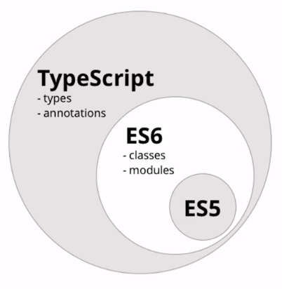

# Introducción a ES6 y  TypeScript (Microsoft)

Typescript es un lenguaje de programación que añade tipos a javascript. Suele
describirse como un superset de javascript ya que todo código válido javascript
es también un código válido typescript.

Se distribuye con una licencia abierta (Apache Licences 2.0) y es desarrollado
y mantenido por Microsoft. 

Se compila para generar código ES6 (también llamado ES2015) o ES5 (diciembre 2009).

Versiones de JavaScript: https://www.w3schools.com/js/js_versions.asp




## Características de ES2015/ES6

### Template literals

```javascript
var texto: "Superman";
var template = `
    <div>El héroe se llama ${texto} </div>

    <button>Click me!</button>
    <div>Esto es una capa</div>

    <input type="text" value="nombre" />
    `
```

- Multilínea
- Interpolación con sintaxis ${variable}

### let/const

- Alternativas a *var* para declarar variables
- Scope restringido al bloque

```javascript
      for (var i = 0; i < 10; i++) {
          // algo
      }
      console.log(i) // 10!

      for (let j = 0; j < 10; j++) {
          // algo
      }
      console.log(j) // j is not defined
```

- No podemos usar una variable antes de definirla

- Binding en cada iteración, nos permite crear funciones en bucles que utilicen variables dentro del for.

### Arrow functions

- Funciones expresadas de forma compactas

```javascript
  increment = function(x) {
        return x+1
  };

  increment = x => x+1;
```

- Con retorno implícito si sólo tienen 1 expresión (no hace falta el return ni las llaves)
- No hacen falta los paréntesis en los parámetros si sólo tienen 1 (si no, () => 1 o (a,b)=>a+b )
- No bindean *this*, por lo que es más fácil definir *event handlers* en el DOM.

### for … of

- Iteración mejorada (no recorre propiedades padre como *for ... in*)
- Funciona con todos los iterables (como strings)

```javascript
    let iterable = [10, 20, 30];

    for (let value of iterable) {
      console.log(value);
    }
    // 10
    // 20
    // 30
```

Más ejemplos en: https://developer.mozilla.org/es/docs/Web/JavaScript/Referencia/Sentencias/for...of

### Sintaxis corta de objetos

Forma breve de definir objetos que usar como nombre de la variable el nombre de la propiedad.

```javascript
    let nombre = 'Carlos';
    var apellido = "Herrera";
    obj = {nombre: nombre, apellido: apellido} // antigua forma
    obj = {nombre, apellido} // nueva forma
    obj = {nombre, apellido, edad, sexo: sex} // nueva forma
```

### Rest y spread

Operadores (¡diferentes!) con la misma sintaxis: … (3 puntos seguidos)

Spread sirve para extraer valores de un array o un objeto:

```javascript
    data = [1, 2, 3];
    log(data[0], data[1], data[2]);

    function log(a, b, c) {
        console.log(`first value is ${a}, second is ${b} and third ${c}`)
    };
```

```javascript
    data = [1, 2, 3];
    log(... data); // uso de spread operator

    function log(a, b, c) {
        console.log(`first value is ${a}, second is ${b} and third ${c}`)
    };
```

Rest para la operación inversa, de elementos a array:

```javascript
    log(1, 2, 3); // uso de rest operator

    function log(... array) {
        console.log(array) // array [1, 2, 3]
    };
```

### Valores por defecto

En parámetros de una función

```javascript
    function ejemplo(valor = 1) {

    }
```

### Destructuring

Descomponer arrays y objetos a variables

```javascript
    let arr = [0, 1, 2];

    //Antes
    //let a = arr[0];
    //let b = arr[1];
    //let c = arr[2];

    //Ahora
    let [a, b, c] = arr;

    console.log(a, b, c) // 0, 1, 2
```

Se puede combinar con valores por defecto y operador rest.

```javascript
    let arr = [0, 1, 2];

    let [a, ...b] = arr;

    console.log(a, b) // 0, [1, 2]
```

```javascript
    let [a, b, c, d = 3] = arr;

    console.log(a, b, c, d) // 0, 1, 2, 3
```

También podemos usarlo para invertir variables

```javascript
    let a = 0;
    let b = 1;

    [b, a] = [a, b];

    console.log(a, b) // 1, 0
````

O para transformar parámetros de entrada de funciones

```javascript
    let arr = [0, 1];

    log(arr);

    function log([a, b]) {
        console.log(a, b)
    }
```

### Clases

Soporte de:

- Herencia ( extends )
- Constructores ( constructor() {} )
- Métodos de instancia ( metodo() {} )
- Métodos estáticos ( static metodo() {} )
- Overrides de métodos a hijos ( super.metodo() )
- Llamadas a constructores padre ( super() )

```javascript
    class AppComponent {

    atributo;

    metodo() {
    }

    constructor() {
    }
```

### Módulos

Podemos crear ficheros javascript en los que exportemos clases, 
funciones, variables o constantes con el keyword `export`:

Archivo `miModulo.js`

```javascript
export function diHola(){
    return "hola"
}

export let pi = 3.14
```

A los archivos que exportan cosas se les denomina módulos.

Después podemos importar dichos módulos desde otros archivos
para usar sus elementos exportados:

```javascript
import { pi, diHola } from './miModulo.js'
```

### Más características de ES2015/ES6

- Soporte para Maps & Sets
- Soporte nativo de promesas
- Async/await

```javascript
  function resolveAfterTime(t){
    let promesa = new Promise((resolve, reject) => {
        setTimeout(() => {
            resolve("¡Promesa resuelta!");
        }, t)
    })

    return promesa;
}

async function asincrona(){
    console.log('calling');
    var result = await resolveAfterTime(1000);
    console.log(result);
    console.log("fin");
}
```

Con **async** le decimos a JavaScript que trate nuestra función de forma diferente: cuando encuentre un **await**, se detendrá y esperará a la resolución de la operación asícrona antes de continuar con el resto del código.


## Características de ES2016/ES7

### Array.prototype.includes

Devuelve *true* si el array contiene el elemento indicado.

```js
const arr = [1, 2, 3, 4, Nan];

//Antes
if(arr.indexOf(3) >= 0) {
  ...
}

//Con includes
if(arr.includes(3)) {
  ...
}
```

Includes también funciona para NaN, mientras que indexOf no.

```js
arr.includes(NaN); //true
arr.indexOf(NaN); //-1
```

### Exponentiation infix operator

```js
//Antes
Math.pow(7, 2); //49

//Ahora
7**2; //49
```

## Características de ES2017/ES8

### Object.values()

Devuelve todos los valores de las propiedades del objeto, excluyendo las encadenadas mediante prototype.

```js
const cars = { BMW: 3, Tesla: 2, Toyota: 1};

//Antes
const vals = Object.keys(cars).map(key => cars[key]);
console.log(vals); // [3, 2, 1]

//Ahora
const vals = Object.values(cars);
console.log(vals); // [3, 2, 1]
```

### Object.entries()

Devuelve en forma de arrray las *keys* y los *values*

```js
const cars = { BMW: 3, Tesla: 2, Toyota: 1};

//Antes
Object.keys(cars).forEach(function(key) {
  console.log('key: ' + key + ' value: ' + cars[key]);
});

//Ahora
for(let[key, value] of Object.entries(cars)) {
  console.log(`key:  ${key} value: ${value}`);
}
```


```js
const cars = { BMW: 3, Tesla: 2, Toyota: 1};

//Antes
const map1 = new Map();
Object.keys(cars).forEach(function(key) {
  map1.set(key, cars[key]);
});
console.log(map1); // Map { BMW: 3, Tesla: 2, Toyota: 1}

//Ahora
const map = new Map(Object.entries(cars));
console.log(map1); // Map { BMW: 3, Tesla: 2, Toyota: 1}
```

### String padding

Dos nuevos métodos en el objeto String para rellenar cadenas de texto.

- padStart
- padEnd

```js
// 'someString'.padStart(numberOfCharcters [,stringForPadding]); 
'5'.padStart(10) // '          5'
'5'.padStart(10, '=*') //'=*=*=*=*=5'
'5'.padEnd(10) // '5         '
'5'.padEnd(10, '=*') //'5=*=*=*=*='
```

## Características de ES2018

### Mejoras en operador rest 

Utilización de rest para extraer solamente una parte de las propiedades

```js
let { firstName, age, ...remaining } = {
  firstName: 'john',
  lastName: 'smith',
  age: 20,
  height: '5.10',
  race: 'martian',
};
firstName; // john
age; // 20
remaining; // { lastName: 'smith', height: '5.10', race: 'martian' }
```

### Mejoras en operador spread

```js
const person = { firstName: 'john', age: 20 };
const account = { EAN: 'xxx-5455-9246', amount: 500 };

const personAndAccount = { ...person, ...account };
personAndAccount; // { firstName: 'john', age: 20, EAN: 'xxx-5455-9246', amount: 500 }
```

### Promise.prototype.finally()

Se incorpora el método **finally()** en las promesas. EL método *finally* se ejecutará siempre. No recibe ningún parámetro.

```js
let started = true;

let myPromise = new Promise(function(resolve, reject) {
  resolve('Promesa resuelta');
})
.then( val => console.log(val) )
.catch( error => console.log(error) )
.finally( () => started = false )
```

### for-await-of Asynchronous Iteration

Permite crear bucles de códigos asíncronos.

```js
const promises = [
  new Promise(resolve => resolve(1)),
  new Promise(resolve => resolve(2)),
  new Promise(resolve => resolve(3)),
];

async function test() {
  for await (const obj of promises) {
    console.log(obj);
  }
}

test(); //prints: 1  2  3
```


## Características de TypeScript

- No es ejecutable. Debe ser compilado primero a ES5 o a ES6.
- Tiene las mismas características que ES5 + ES6 y aporta otras nuevas.
- Tiene detección de fallos al compilar.

### Instalación

```bash
# npm install -g typescript
```

### Compilación (transpilación)

```bash
# tsc index.ts
```

Se crea un archivo `index.js` que ya se puede ejecutar en un entorno javascript (navegador o node).

La compilación se puede afinar mediante modificadores para tener en cuenta muchas [opciones](https://www.typescriptlang.org/docs/handbook/compiler-options.html).

Probablemente dos de las más prácticas son `--lib` y `--target`. La primera
indica las librerías de javascript que se deben usar para realizar la compilación,
mientras que la segunda indica qué versión de javascript deseamos utilizar en la
generación del código javascript.

Si por ejemplo queremos usar características de ES2018 (la última versión de
Ecmascript) y crear archivos de javascript ES5 (la versión más soportada en
los navegadores actuales), la compilación se llevaría a cabo así;

```bash
# tsc --lib ES2018 --target ES5 index.ts
```

### Tipos

boolean | number | string | arrays | enum (enumerados) | Any (cualquiera) | Void (ninguno) | Object

```javascript
      let cadena: string;
      cadena = 'Hola';
      cadena = 2: // ERROR!
```

Con tipado gradual. Podemos no escribir un tipo y el compilador intentará inferirlo y hacer comprobaciones en tiempo compilación.

Tipo *any* para saltarse las comprobaciones de tipos.

La sintaxis en arrays es

```javascript
    let array1: Array<number>;
    let array2: number[];
```

### Interfaces

No generan código en producción, sólo son comprobaciones en tiempo de ejecución

```javascript
    interface Talk {
        name: String;
    }

    let charla = {name: 'Rx'}; //implementación implícita

    class MyTalk implements Talk {
        name = 'Rx';
    }

    let charla2 = new MyTalk(); //implementación explícita
```

### Visibilidad de métodos y propiedades de las clases

La visibilidad es *public* por defecto.

### Constructores breves

```javascript
    constructor(public name: string) {}
```

Equivale a definir un atributo y fijar su valor:

```javascript
    public name: string;

    constructor(name) {
    this.name = name;
    }
```

### Tipos unión 

La propiedad solamente podrá tomar uno de los valores definidos.

```javascript
    pos: ‘North’ | ‘East’;
```

### Definición de tipos

Podemos definir nuevos tipos con `type`

```javascript
    type PuntoCardinal: 'Norte' | 'Sur' | 'Este' | 'Oeste'

    let p: PuntoCardinal
```

### Generics

Hay funciones o clases que pueden generalizarse sobre cualquier tipo de 
dato o sobre un conjunto de tipos. En typescript podemos definir dichas 
funciones o clase haciendo uso de los genéricos.

```javascript
function identity<T>(arg: T): T {
    return arg
}
```

[Índice](index.md)
